# RefuLink

Financial inclusion platform for refugees in Kenya — RIN verification, Stellar wallet, and M-Pesa bridge.

## Project Structure

- `backend/` — Django REST Framework API (Identity, Wallet, Trust Score, M-Pesa)
- `frontend/` — React Native / Expo SDK 55 mobile app
- `contracts/` — Soroban smart contracts (Rust)
- `docs/` — Project documentation and architecture
- `scripts/` — Development and deployment scripts

## Getting Started

1. Clone the repository.
2. Copy `.env.example` to `.env` and configure accordingly.
3. See `docs/setup.md` for full environment instructions.

## CI/CD

Workflows are located in `.github/workflows/`.

---

## System Architecture

> Full interactive diagram: [docs/architecture.html](docs/architecture.html)

```mermaid
%%{init: {
  "theme": "base",
  "themeVariables": {
    "background":           "#0a0a0a",
    "primaryColor":         "#1a1a1a",
    "primaryTextColor":     "#e4e4e7",
    "primaryBorderColor":   "#3f3f46",
    "lineColor":            "#FF6600",
    "secondaryColor":       "#111827",
    "tertiaryColor":        "#0f172a",
    "edgeLabelBackground":  "#0a0a0a",
    "clusterBkg":           "#0f0f0f",
    "clusterBorder":        "#27272a",
    "fontFamily":           "Segoe UI, system-ui, sans-serif",
    "fontSize":             "13px",
    "nodeBorder":           "#3f3f46",
    "titleColor":           "#FF6600"
  }
}}%%

flowchart TB

  subgraph FE["FRONTEND — React Native / Expo SDK 55"]
    direction TB
    LANG["Multilingual UI\nLanguageContext\nEN · SW · SO · AR"]
    BIO["Biometric / PIN\nexpo-local-authentication\nFace ID · Fingerprint"]
    QR["QR Scanner\nexpo-camera\nMerchant / Ambassador"]
    WALLET_UI["Wallet Dashboard\nKES Balance\nTx History · Send · Receive"]
    VERIFY_UI["Identity Vault\nRIN Input\nVerification Badge"]
    BORROW_UI["Borrow Screen\nTrust Score Ring\nLoan Slider"]
  end

  subgraph BE["BACKEND — Django REST Framework"]
    direction TB
    JWT["JWT Auth\nsimplejwt\nAccess · Refresh tokens"]
    subgraph IDENTITY_SVC["Identity Layer"]
      RIN_HASH["SHA-256\nRIN Hasher"]
      IPRS["Mock IPRS\nAlienID DB\n(PostgreSQL)"]
      REG["RefugeeIdentity\nstellar_public_key\nhashed_rin"]
    end
    subgraph WALLET_SVC["Wallet Layer"]
      BAL["Balance API\nGET /wallet/balance/"]
      SEND["Send API\nPOST /wallet/send/"]
      AUDIT["Audit Log\nPOST /wallet/audit/"]
    end
    subgraph TRUST_SVC["Trust & Credit Layer"]
      ENGINE["Trust Score Engine\nVouches · Volume · Age"]
      LOAN["Loan API\nPOST /trust/loan/"]
    end
    subgraph MPESA_SVC["M-Pesa Layer"]
      C2B_VIEW["C2B Webhook\nPOST /mpesa/c2b/"]
      WITHDRAW_VIEW["Withdraw API\nPOST /mpesa/withdraw/"]
      DEP_INFO["Deposit Info\nGET /mpesa/deposit-info/"]
    end
    AI_MW["AI Translation\ndeep-translator\nSW · SO · AR"]
    HORIZON_CLIENT["Horizon Client\npy-stellar-sdk\nBalance · Payments"]
    SOROBAN_CLIENT["Soroban Client\npy-stellar-sdk\nInvoke contract fn()"]
  end

  subgraph DB["POSTGRESQL VAULT — Off-Chain PII"]
    direction LR
    PII_DB[("AlienID\nFull PII\nEncrypted")]
    IDENTITY_DB[("RefugeeIdentity\npublic_key\nhashed_rin")]
    TX_DB[("TransactionLog\nAudit trail")]
    LOAN_DB[("LoanRequest\nCredit history")]
    MPESA_DB[("MpesaTransaction\nDeposit / Withdrawal")]
  end

  subgraph DARAJA["M-PESA / DARAJA API — Off-Chain"]
    direction TB
    C2B_HOOK["C2B Paybill\nCustomer to Business\nWebhook push"]
    B2C_PAY["B2C Payment\nBusiness to Customer\nWithdrawal payout"]
    SAFARICOM[("Safaricom\nNetwork")]
  end

  subgraph STELLAR["STELLAR NETWORK — On-Chain"]
    direction TB
    subgraph SOROBAN_CONTRACT["Soroban Smart Contract (Rust)"]
      SC_REGISTER["register_identity()\nhashed_rin · verified=false"]
      SC_VOUCH["vouch()\nambassador to refugee"]
      SC_VERIFY["set_verified()\nflip verified flag"]
      SC_QUERY["is_verified()\nget_identity()"]
    end
    subgraph KES_LAYER["KES Token Layer"]
      KES_ASSET["KES Stellar Asset\nIssuer: ClickPesa"]
      SEP24_ANCHOR["SEP-24 Anchor\nClickPesa\nMint · Burn"]
      HORIZON_NET["Stellar Horizon\nTestnet\nPayment ops · Ledger"]
    end
  end

  VERIFY_UI  -->|"POST /identity/verify-rin/"| JWT
  WALLET_UI  -->|"GET /wallet/balance/"| BAL
  WALLET_UI  -->|"POST /wallet/send/"| SEND
  BORROW_UI  -->|"GET /trust/score/"| ENGINE
  BORROW_UI  -->|"POST /trust/loan/"| LOAN
  QR         -->|"POST /identity/request-vouch/"| JWT
  WALLET_UI  -->|"GET /mpesa/deposit-info/"| DEP_INFO
  WALLET_UI  -->|"POST /mpesa/withdraw/"| WITHDRAW_VIEW

  BIO        -.->|"Unlocks local\nStellar private key"| WALLET_UI
  AI_MW      -.->|"Translated strings"| LANG

  JWT --> RIN_HASH
  RIN_HASH -->|"SHA-256 digest"| IPRS
  IPRS --> PII_DB
  RIN_HASH --> REG
  REG --> IDENTITY_DB

  REG -->|"register_identity()"| SOROBAN_CLIENT
  SOROBAN_CLIENT --> SC_REGISTER
  SOROBAN_CLIENT --> SC_VOUCH
  SOROBAN_CLIENT --> SC_VERIFY

  BAL --> HORIZON_CLIENT
  SEND --> HORIZON_CLIENT
  HORIZON_CLIENT --> HORIZON_NET
  SEND --> TX_DB

  ENGINE -->|"reads vouch count"| SC_QUERY
  ENGINE --> LOAN_DB

  C2B_HOOK -->|"Daraja webhook"| C2B_VIEW
  C2B_VIEW -->|"mint_tokens_for_deposit()"| HORIZON_CLIENT
  HORIZON_CLIENT -->|"Payment op to KES Asset"| KES_ASSET
  KES_ASSET --> SEP24_ANCHOR
  C2B_VIEW --> MPESA_DB

  WITHDRAW_VIEW -->|"burn_tokens_for_withdrawal()"| HORIZON_CLIENT
  HORIZON_CLIENT -->|"Payment to Issuer"| SEP24_ANCHOR
  SEP24_ANCHOR -->|"Release KES"| B2C_PAY
  B2C_PAY --> SAFARICOM
  WITHDRAW_VIEW --> MPESA_DB

  SAFARICOM --> C2B_HOOK
  SEP24_ANCHOR <--> HORIZON_NET
```

### Flow Summary

**Identity Loop**
1. User enters Alien ID (RIN) in the Identity Vault screen.
2. Django SHA-256 hashes the RIN and checks against the IPRS mock DB. *(Off-Chain)*
3. Backend issues a JWT token and creates a `RefugeeIdentity` with a generated Stellar keypair.
4. Soroban `register_identity()` stores hashed_rin + public key on the Stellar ledger. *(On-Chain)*
5. Ambassador QR scan triggers `vouch()` then `set_verified(true)`; verification badge appears in UI.

**M-Pesa Deposit (Mint)**
1. User taps Deposit and sees Paybill number and account instructions.
2. User sends money via M-Pesa; Safaricom Daraja fires a C2B webhook. *(Off-Chain)*
3. Django matches phone to `RefugeeIdentity`, calls `mint_tokens_for_deposit()`.
4. Stellar payment op sends KES token (ClickPesa issuer) to the user's Stellar address. *(On-Chain)*
5. Wallet Dashboard balance updates via Horizon API on next refresh.

**Withdrawal (Burn)**
1. User taps Withdraw, enters phone number and amount.
2. `burn_tokens_for_withdrawal()` sends KES tokens back to the ClickPesa issuer. *(On-Chain)*
3. Django triggers Daraja B2C payment to the user's phone number. *(Off-Chain)*
4. KES cash arrives in the user's M-Pesa wallet within seconds.

**Trust & Credit**
1. Trust Score Engine reads on-chain vouches from VouchContract. *(On-Chain)*
2. Adds off-chain signals: tx volume, account age, verification status. *(Off-Chain)*
3. Score 0–100 maps to credit limit: 0 / 5K / 15K / 30K KES.
4. Borrow UI renders Gold/Silver/Bronze tier ring and loan slider capped at the limit.

**Security Layer**
1. Stellar private key generated server-side, returned once to the client.
2. Client stores private key in `expo-secure-store` (hardware-backed keychain).
3. `expo-local-authentication` requires Face ID / Fingerprint before any key access.
4. All API calls require a Bearer JWT (60-min lifetime, silent refresh via interceptor).
